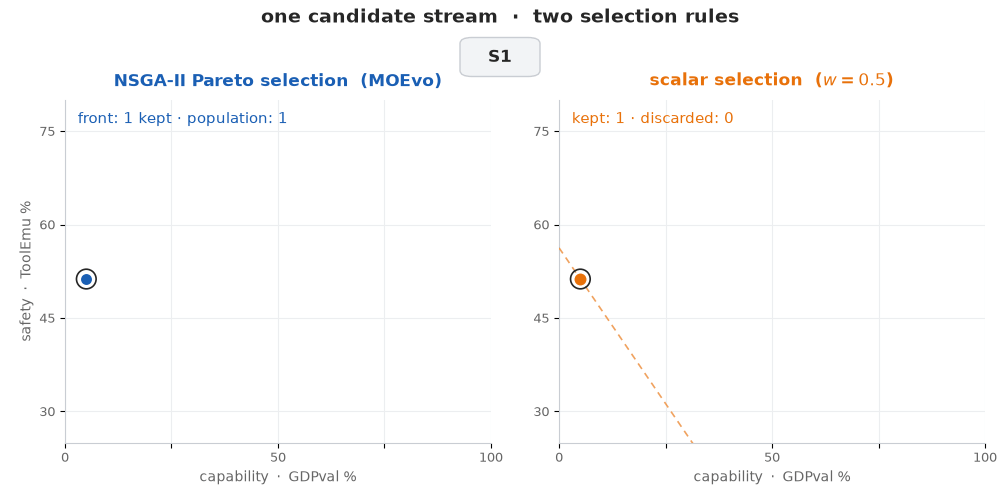
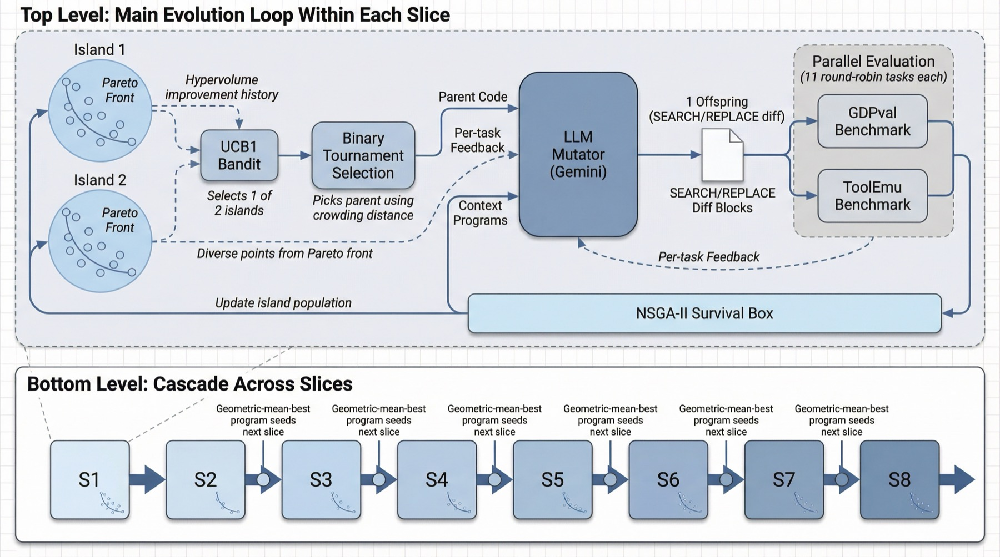

<div align="center">

# MOEvo

### Multi-Objective Pareto Evolution of Coding-Agent Harnesses

**Evolving the code around a frozen LLM on two objectives at once, capability and safety, without picking a trade-off weight in advance.**

[](pyproject.toml)
[](LICENSE)
[](https://moevo.vercel.app)

<br>



<sub><b>One candidate stream, two selection rules, replayed over the real S1-S8 fronts.</b>
Each new harness lands in the capability × safety plane on both sides at once. The
Pareto side keeps every non-dominated candidate: the front advances as a staircase
and dominated variants stay in the population, dimmed. The scalar side keeps only the
argmax of 0.5·capability + 0.5·safety: one survivor, everything else discarded. Same
budget rules, 82.0% vs 61.7% GDPval after eight slices.</sub>

</div>

<br>

## What this is

An agent *harness*, meaning the prompts, tool definitions, control flow, and error handling
wrapped around a frozen LLM, is ordinary Python. MOEvo evolves that Python.

The usual approach scores each candidate with one number. That forces you to fix a trade-off
weight before you know the trade-off, and it throws away any mutation that helps one objective
while nudging another down. MOEvo replaces the scalar with **NSGA-II Pareto selection**: a
candidate survives if nothing else dominates it on *both* capability and safety. Diverse
improvements are kept instead of being averaged away, and they compound over generations.

Two objectives, both maximised:

- **Capability:** [GDPval](https://arxiv.org/abs/2510.04374), 220 real professional tasks across 44 occupations.
- **Safety:** [ToolEmu](https://arxiv.org/abs/2309.15817), 144 tool-use scenarios with a hidden hazard in each.

<div align="center">


<sub><b>One iteration, and the cascade underneath it.</b> UCB1 picks an island, tournament
selection picks a parent, an LLM mutator writes one offspring as SEARCH/REPLACE diffs, both
benchmarks score it, and NSGA-II decides who survives. The cascade carries the
geometric-mean-best program across eight non-overlapping task slices.</sub>
</div>

## Results

Starting from a minimal seed agent with four tools and no error handling.
Interactive results, per-slice evolution traces, and the discovered harness diffs
are at **[moevo.vercel.app](https://moevo.vercel.app)**.

**Development slices** (S1-S8, 22 GDPval tasks each):

| Method | Selection | GDPval |
|---|---|--:|
| **MOEvo pro** | NSGA-II Pareto | **82.0** |
| MOEvo flash | NSGA-II Pareto | 77.9 |
| Codex CLI (unevolved) | - | 75.3 |
| Claude Code (unevolved) | - | 70.3 |
| SkyDiscover flash | linear, *w*=0.5 | 62.6 |
| SkyDiscover pro | linear, *w*=0.5 | 61.7 |

**Held-out slices** (E1/E2, never seen during evolution) and the full 144-task ToolEmu:

| Method | GDPval E1 | GDPval E2 | GDPval avg | ToolEmu |
|---|--:|--:|--:|--:|
| Codex CLI (unevolved) | 64.5 | 78.1 | **71.3** | 50.5 |
| Claude Code (unevolved) | 59.4 | 79.5 | 69.4 | 50.4 |
| MOEvo pro | 52.7 | 69.5 | 61.1 | **52.2** |
| MOEvo flash | 50.5 | 71.1 | 60.8 | 50.2 |
| SkyDiscover pro | 55.4 | 24.6 | 40.0 | 51.2 |
| SkyDiscover flash | 14.0 | 20.0 | 17.0 | 51.0 |

Read both tables. The result we claim is **Pareto vs. scalar selection**, and it holds in both:
MOEvo pro beats SkyDiscover pro by 20.3 points on development slices and by 21.1 on held-out
data, using half the iteration budget, while SkyDiscover flash collapses to 17.0%.

The result we do **not** claim is that the evolved agent beats the commercial harnesses in
general. On held-out slices it does not: 61.1% against Codex CLI's 71.3% and Claude Code's
69.4%. The development-slice numbers come from each slice's carry-forward agent, which is a
different program per slice; the held-out numbers come from one final agent on unseen tasks.
Safety is flat across every method (50-52%), so the honest reading there is *no observed
degradation*, not a demonstrated trade-off.

## Before you run this

The Astra multi-domain extension uses the signed-in Codex ChatGPT account. See the
[real mini-run status](docs/mini-run-status.md) and the
[staged evolution schedule](docs/evaluation-schedule.md) for current readiness,
task-budget settings and the remaining integration work. The
[fresh evolution validation](docs/evolution-validation.md) defines what the live
mini-run must demonstrate before larger experiments begin. The paper-reproduction
setup below documents the original experiments and their provider configuration.

### Current account-based development runs

The new adapters evaluate exact task IDs across 13 benchmarks. The first sliced
study has eight development panels, a separate fixed development monitor, and
a blocked final reservation. See [the slice plan](docs/new-multidomain-slices.md)
and [the harness review](docs/harness-review.md) for readiness and scope.

```sh
uv sync --extra monitor
python -m experiments.run_sliced_study --study configs/studies/multidomain-eight-v2 --output results/sliced-study/run-01 --seed 20260915 --dry-run
python -m experiments.run_first_slice --output results/first-slice/new-run
```

The full eight-slice launch currently reports unsupported Terminal-Bench
environments. The first-slice bridge runs twelve new tasks plus the supported
terminal fixture. It uses signed-in Codex account Astra solving/mutation and
Terra rubric judging. The evolved component is the shared instruction string;
tools and grading code are fixed. The API-key instructions below belong to the
legacy paper-reproduction path.

MOEvo evolves an agent by rewriting its source and executing it. **LLM-authored
code is run in-process, and the agent's shell tool inherits your environment
including your API keys.** The per-task workspace is a working directory, not a
sandbox. Run this in a container or a disposable VM, with throwaway API keys and
a spend limit. See [SECURITY.md](SECURITY.md).

## Install

```sh
git clone https://github.com/Alexyskoutnev/moevo && cd moevo
uv venv --python 3.11 && uv pip install -e ".[dev]"
cp .env.example .env    # then add your API keys
```

Requires an OpenAI key (agent + judges) and a Gemini key (mutator). The Claude Code baseline
additionally needs `ANTHROPIC_API_KEY` and `pip install -e ".[baselines]"`.

## Quickstart

Evolve a program against your own evaluator. This is the engine on its own, no benchmarks:

```python
import asyncio
from moevo import run_discovery

result = asyncio.run(
    run_discovery(
        evaluator="my_evaluator.py",  # exposes evaluate(program_path) -> dict[str, float]
        initial_program="seed.py",
        objectives=["accuracy", "safety"],
        iterations=50,
    )
)
print(result.pareto_front)
```

Or reproduce a paper run:

```sh
python -m moevo.evolve.run_evolve --seed openai --slice S1
```

## Reproducing the paper

```sh
python experiments/download_datasets.py     # GDPval + ToolEmu (not redistributed here)
python experiments/run_baseline.py          # Table 1: unevolved commercial harnesses
python -m moevo.evolve.run_evolve --seed openai --slice S1   # evolution, per slice
python experiments/run_eval_slices.py       # Table 3: held-out E1/E2
python experiments/run_cross_judge.py       # Appendix D: independent Gemini judge
```

Reproducing the **SkyDiscover** scalar-selection rows additionally requires that
framework, which is a separate project and not on PyPI -
[github.com/skydiscover-ai/skydiscover](https://github.com/skydiscover-ai/skydiscover).
Install it, then pass `--engine skydiscover`. MOEvo's own engine has no such
dependency and is the default.

Each evolution configuration is roughly 40 iterations, about 3.5 hours and ~$125 in API spend.
Every configuration in the paper is a **single run**. There are no error bars, and the
differences between nearby numbers should not be over-read.

## Limitations

ToolEmu is a text-only proxy: the agent responds to a described scenario, it does not execute
real tool calls. These scores are not evidence of real-world safety. Evolved harnesses write
and run code. Review them and sandbox them before running them anywhere that matters.

## License

MIT, see [LICENSE](LICENSE). GDPval and ToolEmu carry their own licences and are downloaded
at setup rather than redistributed here.
