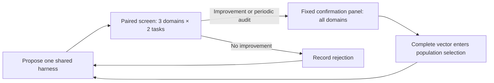

# Evaluation budget for many-domain evolution

Implemented 2026-09-15. **The engine supports staged evaluation, with a first
real diagnostic epoch connected to 13 existing fixtures across 11 domains.**
Expanded search/selection/test panels and representative headroom measurements
are still required. The [mini integrations](mini-run-status.md) and this small
epoch do not establish full-benchmark improvement.

## First diagnostic epoch

`experiments/run_pilot_epoch.py` connects the existing fixtures through an explicit
task adapter. It checks the returned published task ID and grades the actual
candidate's submission. It does not simulate new examples by relabeling a fixture.

- Four mutations make one rotation across the 11 included domains.
- Each screen uses three domains and one existing task per domain.
- The fourth screen is forcibly audited; other candidates get confirmation when
  a screened objective improves.
- Every confirmed vector uses the same 13 tasks; maximum execution budget is 65,
  with two task workers. Errors consume this budget.
- The evolvable component is the shared `INSTRUCTIONS` string, parsed as a literal
  without executing generated Python. Models, tool implementations and budgets
  are fixed. Full agent-loop/code evolution is a later experiment.
- Search uses native normalized scores, except Harvey uses criterion pass rate
  for a less coarse search signal; its native all-pass result remains recorded.
  Domain scores are fixed arithmetic means. Medical rubric scores are clipped
  to [0,1] for search, with native scores preserved.
- Automation and education remain excluded for their unresolved integration
  issues. Terminal-Bench Science stays excluded until image access is repaired.

Run and inspect:

```sh
MOEVO_ACCOUNT_ONLY=1 .venv/bin/python -m experiments.run_pilot_epoch \
  --output results/pilot-epoch/astra-terra-01
.venv/bin/python -m experiments.evolution_dashboard \
  --run results/pilot-epoch/astra-terra-01 --port 8765
```

The local dashboard at `http://127.0.0.1:8765` shows raw complete-candidate curves,
per-domain plots, a radar comparison of actual candidates, budget and coverage.
Screen deltas appear separately, so small changing task panels are never presented
as comparable complete scores. `--export path/to/dashboard.html` saves a portable
snapshot. Plots use Matplotlib; there are no external dashboard services or CDNs.

### Separate model roles

Generation and solving remain **`gpt-6-astra` / `xhigh`**. New rubric-judge runs use
**`gpt-5.6-terra` / `medium`**, through the same signed-in Codex account. Native
deterministic graders are unchanged. The task adapter receives `judge_model` and
`judge_reasoning_effort` in the task request. The main staged CLI exposes both;
they are also part of the cache/checkpoint protocol signature.

This choice is consistent with the [official model guide](https://learn.chatgpt.com/docs/models),
which positions Terra for everyday work and Astra for demanding multistep work.
It is a pilot judge choice, not evidence of equivalent grading accuracy. Terra
passed 10 real transport/polarity controls across DSBench, GDPval, Harvey and
HealthBench; see the [judge protocol](../submissions/superharness-astra-terra-pilot/README.md).
Expert-level judge agreement still needs calibration on actual submissions.

The old Astra-judged manifest and results remain unchanged. Baseline and candidate
must use the same judge protocol within a run; changing the judge is not a harness
improvement. The new epoch evaluates a fresh seed under the Terra judge protocol.

## Initial settings for larger panels

An iteration proposes one child harness. It is not a generation of an entire
population. Start with these settings, then tune them using measured execution
cost and the audit results:

| Stage | Initial setting | What it does |
| --- | --- | --- |
| Seed | One fixed search comparison panel | Establish a complete starting vector; reuse across islands |
| Paired screen | 3 rotating domains × 2 tasks | Run parent and child on identical task IDs and seed/replicate identifiers |
| Continue | Improvement on any screened domain | Allow trade-offs into the broader check; ties and losses normally stop here |
| Audit | Every 10th screen attempt | Run the broader check even without a screen improvement |
| Confirmation | Fixed panel covering every objective and every included benchmark | Only these complete vectors enter population selection |
| Budget | 1,000 task executions; at most 100 proposal iterations for the first pilot | Stop when the next complete stage does not fit |
| Search output | One candidate selected by weakest-domain score, then second weakest, etc. | An actual shared harness, using the complete search panel |
| Selection / final test | Separate later phases | Larger independent selection panel, then one frozen-artifact test; never send these results to the proposer |

For the current **11 candidate domains**, rotation reaches every domain within
four screen attempts. Domain admission remains subject to baseline headroom and
adapter validity. Education and the unresolved AutomationBench fixture remain
outside the candidate suite; finance, science and mathematics each contain two
benchmarks. Science's image-access limitation must be repaired before admission.

Start the comparison panel at **two tasks per domain**, with at least one task
from each benchmark: 22 tasks if all 11 domains are admitted. The manifest owns
the actual counts; the scheduler rejects a panel missing any included benchmark.
Two tasks are a cheap search signal, not an accuracy estimate or sufficient
evidence for final promotion. Freeze this panel throughout a run. To increase it,
start a new run and re-evaluate candidates on the new panel.



Screening is a heuristic and can reject useful mutations. The audit records
whether a rejected-by-screen candidate would improve any objective on the
confirmation panel. Examine the missed-improvement rate, including ties, before
reducing audit frequency. An inconclusive tiny panel is not a statistical proof
of regression. Keep NSGA-II, NSGA-III, and scalar controls on the same schedule
and execution budget when comparing survival rules.

For an NSGA-III pilot with 11 axes, this implementation requires at least
12 population slots per island: **24 total for two islands**, versus the old
default of 10. Use the same capacity for selector comparisons. Capacity is a
retention limit; the engine still starts with one shared seed per island.
NSGA-II remains the general default; no selector has won the multi-domain study.

## What the budget really buys

For a rejected candidate, there are 6 child task executions and 0–6 uncached
parent executions. A confirmed candidate additionally needs the 22-task
comparison panel, minus child results already cached from overlapping tasks.
The seed costs 22 once. Failed or interrupted executions consume budget too.
Cached observations are reused, not counted as independent repeat samples.

For example, assume 25% pass the screen and 10% of the remainder get audited.
That makes 32.5% eligible for confirmation. With no screen/confirmation overlap,
the estimate is **13.15–19.15 task executions per proposal**, depending on parent
cache hits, versus 22 for evaluating every child directly. This is arithmetic
under assumed rates, not a measured speedup. If almost all candidates pass,
screening adds overhead. Use the ledger to decide whether to widen the screen,
raise audit frequency, or return to full evaluation.

A task execution is one complete solver-plus-grader attempt. It can contain many
model/tool calls. The task cap is **not a token, wall-time, or subscription quota
cap**, and proposer calls are additional. Each real adapter must keep its own
fixed per-task limits and return model usage. Judge and simulator calls count
toward reported usage. Expensive document, terminal and service tasks may dominate
wall time even when the task counts look balanced.

## Adapter and manifest contract

Enable with `--evaluation-manifest path/to/search.json`. The evaluator module
must export a synchronous or asynchronous function:

```python
def evaluate_task(program_path: str, task: dict) -> dict:
    # Run THIS candidate on THIS published task with fixed tools and budgets.
    # Keep gold answers, hidden tests, and grading code outside its workspace.
    # Use the signed-in Codex account for model calls, with no API fallback.
    # Invoke the verified benchmark grader after collecting the submission.
    # Forward task['judge_model'] and task['judge_reasoning_effort'] to rubric judges.
    return {
        "status": "scored",
        "score": 0.0,             # predeclared normalized objective, finite [0, 1]
        "native_metrics": {},     # preserve the benchmark's original metrics
        "usage": {},              # solver, judge, simulator calls/tokens
        "feedback": "bounded search-only failure trace",
    }
```

`blocked`, `needs_audit`, null scores, nonfinite scores and unnormalized values
are errors. They are never converted into a zero fitness score. Real scored
zeros are valid. Do not invent an adapter by invoking the same fixed mini fixture
under different IDs or seeds.

The following shows the manifest **format only**; the task IDs are placeholders:

```json
{
  "version": 1,
  "split": "search",
  "protocol": "<pinned data, model/effort, grader, tools, runtime, budgets and metric mapping>",
  "tasks": [
    {"id": "finance/1", "objective": "finance", "benchmark": "bizfinbench",
     "task_id": "<published-task-id-1>", "seed": 42},
    {"id": "finance/2", "objective": "finance", "benchmark": "bizfinbench",
     "task_id": "<published-task-id-2>", "seed": 42}
  ],
  "confirmation_ids": ["finance/1", "finance/2"]
}
```

Use larger search pools than the comparison panel where data supports it. Tasks
rotate within domains. Predeclare task/benchmark weights by selecting the panel;
scores are arithmetic task means within each objective. Split related reports,
environments and task families together before generating manifests. This engine
accepts only `split="search"`; keep selection and final-test manifests elsewhere.
Seed fields identify evaluation replicates; they do not make model sampling
deterministic if the underlying model service has no seed control.

The protocol string must change when imported helper code, external graders,
dataset revisions, images, model effort or budgets change. The scheduler also
hashes the complete manifest, evaluator entry file, model name and scheduling
settings automatically. It cannot detect a changed remote dependency that was
not pinned in the manifest.

Once those real adapters and panels are ready, the pilot options are:

```sh
MOEVO_ACCOUNT_ONLY=1 .venv/bin/python -m moevo.cli seed.py verified_tasks.py \
  --model codex/gpt-6-astra \
  --judge-model gpt-5.6-terra --judge-reasoning-effort medium \
  --objectives finance science mathematics planning operations_research \
    data_analysis professional_work terminal legal medicine customer_service \
  --evaluation-manifest data/splits/search.json \
  --screen-domains 3 --screen-tasks-per-domain 2 --screen-audit-every 10 \
  --max-task-evaluations 1000 --iterations 100 \
  --population-size 24 --num-islands 2 --selection nsga3 \
  --output-dir results/astra-staged-pilot
```

The command above is for the future expanded-panel study; `seed.py`,
`verified_tasks.py`, and its larger frozen multi-task manifest are placeholders.
Use the diagnostic runner above for the existing fixtures. Existing
`evaluate(path)` adapters keep the original full-evaluation behavior unless the
new interface is explicitly enabled. Missing task-level support fails before
mutation or task execution.

## Evidence and recovery

`evaluation_state.json` contains task observations, source/protocol fingerprints,
execution counts, time and adapter-provided usage, paired deltas, screen decisions,
and audit outcomes. Task calls are charged atomically **before** execution so a
crash cannot reset the budget. Staged runs checkpoint the population after each
iteration. Use `--resume` to reuse matching observations; use a new output directory
for a new protocol. Increasing the total task cap on resume is allowed.

If a crash occurs between a task call and the next population checkpoint, the
ledger can be ahead of the population. Completed observations remain reusable
and all dispatched attempts remain charged; the interrupted proposal itself may
be regenerated. This is not a promise of identical model sampling after a crash.

Offline tests exercise the full controller with deterministic fake task adapters,
including cross-domain regressions, periodic audits, cache reuse, restart,
budget termination, invalid grading statuses and held-out-manifest rejection.
They validate scheduling logic, not additional benchmark/model integrations.

## Research basis

The [GEPA implementation guide](https://gepa-ai.github.io/gepa/guides/faq/)
describes paired parent/child minibatches and larger validation after improvement.
We adapt that resource-allocation idea to domain rotation and add forced audits;
this is not the complete GEPA algorithm. We preserve one fixed, complete search
comparison panel so population vectors remain comparable.

[Hyperband](https://www.jmlr.org/papers/v18/16-558.html) motivates allocating more
resources to promising configurations. Its guarantees do not transfer directly
to noisy, many-objective harness editing. Benchmark this scheduler against full
evaluation at matched total execution budgets before claiming sample efficiency.
